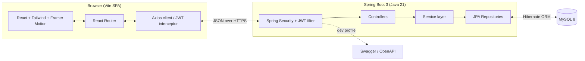
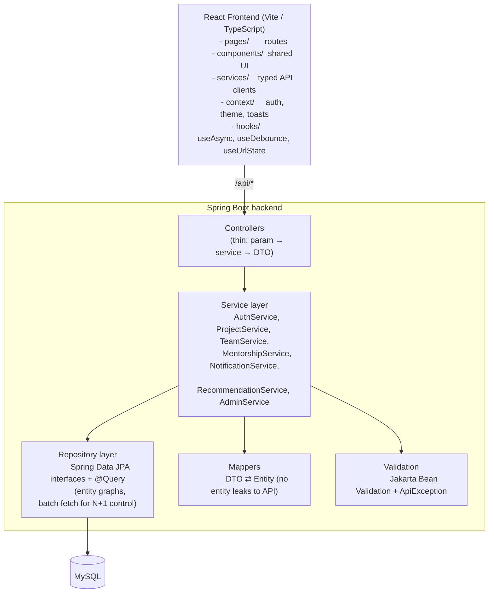
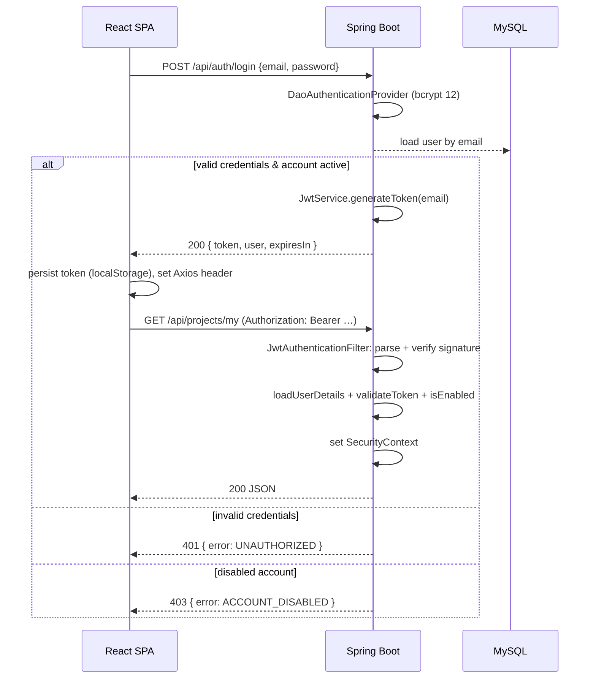
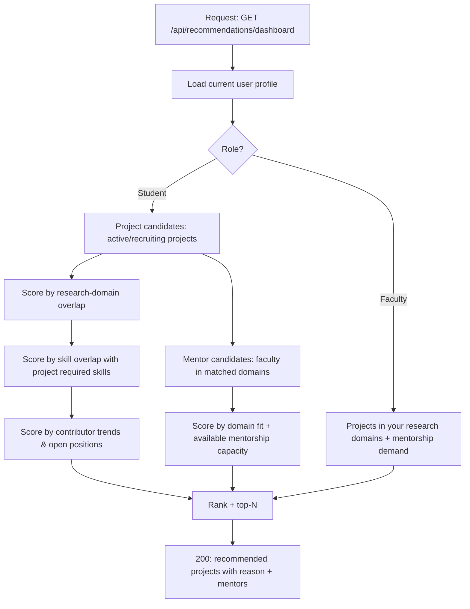
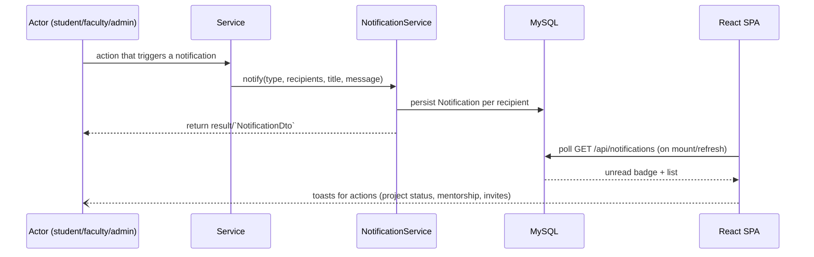
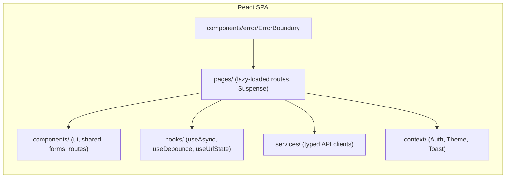

# Innovasphere — System Architecture

Innovasphere is a **platform for university research collaboration**: students and
faculty browse projects, form teams, request and accept mentorship, and receive
personalised recommendations and notifications.

## High-level architecture



```
Browser ── Vite dev server / Nginx (prod) ── Axios ── Spring Security ── Controller
        ── Service ── Repository (Spring Data JPA) ── MySQL
```

## Layers



Key rules:

- **Controllers stay thin** — they translate HTTP → service calls and never contain
  business logic.
- **DTOs everywhere** — entities never cross the HTTP boundary (JSON serialisation is
  explicit via mappers).
- **Uniform errors** — every failure becomes `ApiError{status,error,message,path,fieldErrors,timestamp}`.
- **Transaction boundaries** live on the service layer (`@Transactional`).

## JWT authentication flow



Fail-secure notes: the `prod` profile **requires** `JWT_SECRET` (no default value) and
rejects tokens signed with under-32-byte keys; Swagger/actuator docs are disabled in
production.

## Recommendation engine flow



## Notification flow



Fan-out is **synchronous and transactional** — a notification is persisted in the same
transaction as the triggering action, so users never miss system events.

## Frontend structure



Every route chunk is code-split with `React.lazy`; shared vendor code (`react`,
`recharts`, `framer-motion`/`lucide`) is hoisted into stable chunks.