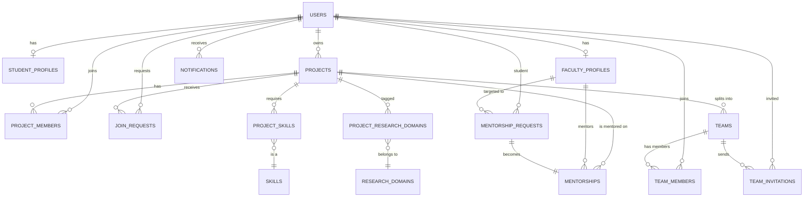

# Innovasphere — Entity Relationship Diagram

Innovasphere is modelled around **15 core entities**. The many-to-many
`project_research_domains` and `team_members` join tables are described as
relationships below (they support the `projects ↔ research_domains` and
`teams ↔ users` associations).

## Entity dictionary

| Entity | Table | Purpose | Key fields |
| ------ | ----- | ------- | ---------- |
| User | `users` | Account, identity, role | `id`, `username`, `email`, `passwordHash`, `fullName`, `role`, `is_active` |
| StudentProfile | `student_profiles` | Student metadata | `id`, `user_id`, `degree`, `department`, `year`, `bio` |
| FacultyProfile | `faculty_profiles` | Faculty metadata | `id`, `user_id`, `designation`, `department`, `expertise`, `bio` |
| Project | `projects` | Research collaboration | `id`, `owner_id`, `title`, `shortDescription`, `description`, `status`, `repositoryUrl` |
| ProjectSkill | `project_skills` | Required skills (with level) | `id`, `project_id`, `skill_id`, `requiredLevel` |
| Skill | `skills` | Reusable skill vocabulary | `id`, `name`, `category` |
| ResearchDomain | `research_domains` | Research area vocabulary | `id`, `name`, `description` |
| ProjectMember | `project_members` | Users working on a project | `id`, `project_id`, `user_id`, `roleInProject` |
| JoinRequest | `join_requests` | Request to join a project | `id`, `project_id`, `user_id`, `message`, `status` |
| Team | `teams` | Project sub-team | `id`, `project_id`, `name`, `description` |
| TeamInvitation | `team_invitations` | Invite to a team | `id`, `team_id`, `user_id`, `status` |
| MentorshipRequest | `mentorship_requests` | Student proposes mentor | `id`, `student_id`, `faculty_id`, `project_id`, `message`, `status` |
| Mentorship | `mentorships` | Accepted mentoring relationship | `id`, `faculty_id`, `student_id`, `project_id`, `startDate` |
| Notification | `notifications` | User inbox activity | `id`, `user_id`, `type`, `title`, `message`, `read` |

## Relationship semantics

- `users.role` ∈ { `STUDENT`, `FACULTY`, `ADMIN` } — a student or faculty member has a
  dedicated 1:1 profile row.
- `projects.owner_id → users.id` (1:N) — every project has exactly one owner.
- `projects ↔ research_domains` is M:N via `project_research_domains`.
- `projects ↔ skills` is M:N via `project_skills` (with a per-skill required level).
- `teams ↔ users` is M:N via `team_members`.
- `mentorship_requests.status` ∈ { `PENDING`, `ACCEPTED`, `REJECTED` } — only an accepted
  request materialises a `mentorships` row (1:1).
- `projects.status` ∈ { `IDEA`, `PROPOSAL`, `ACTIVE`, `COMPLETED`, `ARCHIVED` }.

## Indexes & constraints

- Unique: `users.email`, `users.username`, `project_skills(project_id, skill_id)`.
- Indexed: `users(role)`, `users(email)`, `projects(status)`, `projects(owner_id)`,
  `project_skills(project_id)`, `project_skills(skill_id)`.
- Foreign keys are indexed automatically by MySQL.